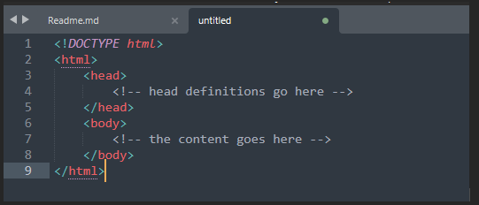

## WHAT IS GIT 

•Git is a distributed version control system that lets you manage and keep track of your source code.

## WHAT IS GITHUB

•Github is a web-based Git repository hosting Git repository for teams to store their code in a centralized location. GitHub offers all the distributed revision control and source code management (S0CM) functionality of Git as well as adding its own features

# HTML TUTORIAL

•HTML (Hypertext Markup Language) is a standard developed over the years to convey information over the internet by using “hyperlinks”.

•The last version of HTML is HTML 5.0, which is an extremely comprehensive platform that allows creating a high-end user interface together with the power of CSS and JavaScript

## YOUR FIRST HTML PAGE

•Let's start by creating a simple HTML page. An HTML page has the following basic layout. For this tutorial I’ll be using sublime as my code editor, you can use any code editor of your choice

•Let's start by creating a simple page that contains the phrase "Hello, World!" in the body. The page will also have a title - that thing that shows up in the title of the tab in your browser. 

The <title> element defines the title of the HTML page.

•The <!DOCTYPE html> tag defines the document type that the browser is going to render. This is used for legacy reasons. If you want to get to the latest version of HTML (HTML5) then it's recommended to use this tag.

•The 
 element defines a "paragraph", a block of text that has a small amount of spacing in between its top and bottom.

•Notice how the tags have a start tag and an end tag denoted with a slash (
). Everything in between is the content of the tag. The content of a tag can usually have additional HTML tags within them as shown below;

•Make sure to save your file as “index.html”. The "index.html" file is the default file that a web server will look for when accessing a website. After saving the file, you can double click it to open it with your browser. (Most preferably Chrome cause it supports all html commands).

•To those who are new to sublime and are finding it difficult to run their HTML file, see below simple steps.
  
I.Tools -> Build System -> New Build System...
II.Add the following Text for opening with Google Chrome
  
{      "cmd": ["open" "-a" "Google Chrome" "$file"]----for mac
  
{ "cmd": ["PATH_TO_YOUR_CHROME" "$file"] }-------for windows

then proceed to save your file as “Chrome.sublime-build”

IV.When you go back to Tools -> Build System , you’ll see chrome has been added as an option as shown below.

![]Picture4.png)

•To run your code, open the HTML file then right click and choose run in browser option and you will be directed to chrome as your default browser.

•You can add any paragraph of your choice and mine looked like this;

